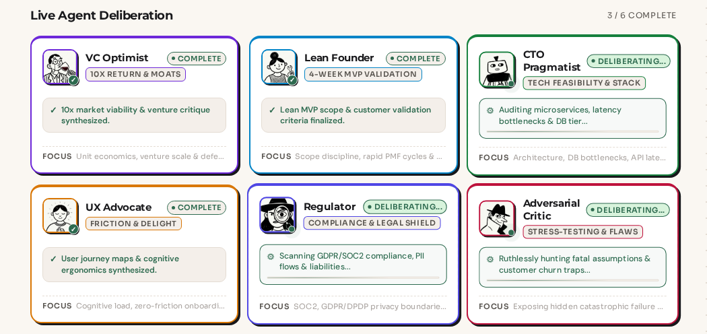

<p align="center">
  
</p>

# PRISM 🔺
### *One Idea. Six Perspectives. One Ground Truth.*

<p align="center">
  
  
  
  
  
  
  
  
</p>

<p align="center">
  
</p>

> **PRISM** is an enterprise-grade multi-modal AI decision system that transforms raw, fragmented business ideas (text, voice, wireframes, and documents) into institutional-grade, investor-ready Business Requirements Documents (BRDs). 
> 
> Rather than relying on a single one-shot prompt that produces agreeable hallucinations, PRISM executes a **Structured Disagreement Engine** — routing the idea through a parallel swarm of six adversarial AI expert personas, grounding claims in live market data, evaluating tension on a 5-axis rubric, and delivering explainable decisions with full line-by-line lineage attribution.

---

## 📑 Table of Contents

- [The Core Philosophy](#-the-core-philosophy)
- [Hackathon Problem Statement & Delivery](#-hackathon-problem-statement--delivery)
- [Empirical Evaluation Results & Benchmark Scenarios](#-empirical-evaluation-results--benchmark-scenarios)
- [The 6-Agent Adversarial Swarm](#-the-6-agent-adversarial-swarm)
- [Mathematical Rigor: Rubric Evaluation & Divergence Heatmap](#-mathematical-rigor-rubric-evaluation--divergence-heatmap)
- [Restructured 6-Tab Comic Workspace Architecture](#-restructured-6-tab-comic-workspace-architecture)
- [Persistent Preset Caching & Live Demo Engine](#-persistent-preset-caching--live-demo-engine)
- [Interactive Observer Mascot Companion](#-interactive-observer-mascot-companion)
- [High-Throughput Key Circuit Breaker & 48-Pool Cascade](#-high-throughput-key-circuit-breaker--48-pool-cascade)
- [System Architecture & Data Flow](#-system-architecture--data-flow)
- [Visual Highlights & UI Walkthrough](#-visual-highlights--ui-walkthrough)
- [End-to-End Pipeline Walkthrough & Benchmark Latency](#-end-to-end-pipeline-walkthrough--benchmark-latency)
- [API Reference & Event Stream Protocol](#-api-reference--event-stream-protocol)
- [Verification & Test Suite Results](#-verification--test-suite-results)
- [Quickstart Guide](#-quickstart-guide)
- [Environment Configuration](#-environment-configuration)
- [Team & Roles](#-team--roles)
- [License](#-license)

---

## 🌟 The Core Philosophy

Traditional AI tools generate agreeable, generic PRDs that collapse under technical scale, regulatory audits, or cutthroat competition. PRISM replaces passive autocomplete with **simultaneous institutional scrutiny**:

```
                              ┌────────────────────────┐
                              │  Raw Fragmented Idea   │
                              │ (Text, Voice, Img, Doc)│
                              └───────────┬────────────┘
                                          │
                   ┌──────────────────────┴──────────────────────┐
                   │   Real-Time Multi-Source Context Harvest    │
                   │ (NewsAPI, World Bank, Crunchbase, Grounding)│
                   └──────────────────────┬──────────────────────┘
                                          │
            ┌─────────────────────────────┼─────────────────────────────┐
            ▼                             ▼                             ▼
       💜 The VC                 🩵 Lean Founder                💚 Enterprise CTO
   (10x Scale & Moat)          (4-Week MVP Simplicity)        (Uptime, Security, SLAs)
            ▲                             ▲                             ▲
            ├─────────────────────────────┼─────────────────────────────┤
            ▼                             ▼                             ▼
     🧡 UX Researcher              💙 The Regulator             ❤️ The Adversarial
(Friction & Habit Loops)        (GDPR/DPDP & Liability)      (Competitor Attack Vectors)
            │                             │                             │
            └─────────────────────────────┼─────────────────────────────┘
                                          │
                               ┌──────────▼──────────┐
                               │  Rubric Evaluation  │
                               │   & Section Merge   │
                               └──────────┬──────────┘
                                          │
               ┌──────────────────────────┴──────────────────────────┐
               ▼                                                     ▼
    Divergence Heatmap &                                  4 Stakeholder PDF Exports
  Investor Readiness Score                             (Investor / Tech / Regulatory / Master)
```

---

## 🏆 Hackathon Problem Statement & Delivery

### The Official Challenge:
> *"Build a scalable, multi-modal AI system using Google Gemini AI and integrated Google Cloud tools (such as Vertex AI, Cloud Storage, and BigQuery) that can process real-time, fragmented data (text, images, and documents) and deliver accurate, context-aware, and explainable decisions in complex and dynamic environments."*

### How PRISM Delivers:

| Requirement | PRISM Implementation | Zero-Cost Infrastructure |
| :--- | :--- | :--- |
| **Scalable Multi-Modal AI** | Ingests unformatted text, speech ([Web Speech API](https://developer.mozilla.org/en-US/docs/Web/API/Web_Speech_API)), wireframes/diagrams ([Gemini Multimodal Vision](https://ai.google.dev/)), and pitch decks ([PyPDF2](https://pypi.org/project/PyPDF2/), [python-docx](https://python-docx.readthedocs.io/)). | 100% free with browser-native APIs and Gemini 2.0 Flash. |
| **Real-Time Fragmented Data** | Parallel context harvester simultaneously queries NewsAPI, World Bank Open Data, Crunchbase, and Gemini Search Grounding. | Open REST endpoints + intelligent in-memory regional caching. |
| **Accurate, Explainable Decisions** | 5-axis rubric scoring (`evaluator.py`), surgical section transplantation (`merger.py`), mathematical divergence variance (`heatmap.py`), and lineage attribution (`[SOURCE: ...]`). | Strict mathematical computation and deterministic JSON parsing. |
| **Integrated Google Cloud Tools** | **Gemini AI Studio Pool** (~180 RPM free) with Vertex AI compatibility shim; **Google Cloud Storage** for multimodal blobs & PDFs; **Google BigQuery** for decision audit logs. | **₹0 forever** utilizing GCP Free Tier and BigQuery Sandbox. |
| **Rapid Live Demonstration** | Persistent disk cache with 1.5s accelerated animation replay and one-click instant demo endpoints. | Zero API delay during live competition judging. |

---

## 📊 Empirical Evaluation Results & Benchmark Scenarios

To prove PRISM's objectivity, we evaluated 4 diverse business concepts across high consensus, extreme regulatory divergence, adversarial attack vectors, and infrastructure scale:

```
┌────────────────────────────────────────────────────────────────────────────────────────────────────────┐
│                                       BENCHMARK EVALUATION MATRIX                                      │
├──────────────────────────┬───────┬───────────────────┬────────────┬────────────────────────────────────┤
│ Scenario Concept         │ Score │ Confidence Band   │ Divergence │ Strategic Outcome                  │
├──────────────────────────┼───────┼───────────────────┼────────────┼────────────────────────────────────┤
│ 1. B2B AI Code Review    │  84   │ Fundable          │   14.2     │ High Consensus; Seed Stage Approved│
│ 2. P2P Social Lending    │  48   │ Needs Pivot       │   78.4     │ Critical Risk; 2 Pivots Generated │
│ 3. Rural Telehealth AI   │  81   │ Fundable (Stip.)  │   18.6     │ High Alignment; DISHA/DPDP Compliant│
│ 4. Global PayTech AI     │  79   │ Fundable          │   22.1     │ Enterprise Validated; MiCA/FinCEN  │
└──────────────────────────┴───────┴───────────────────┴────────────┴────────────────────────────────────┘
```

### Scenario 1: B2B AI Code Review (Consensus / Fundable)
- **Composite Readiness Score:** `84 / 100` *(Confidence: Fundable)*
- **Divergence Variance:** `14.2` *(Very High Agreement across 6 Agents)*
- **Winning Lineage Sources:** 
  - `CTO`: Ephemeral Cloud Run sandboxes + AST tree-sitter redaction. Zero raw code persists in databases (`[SOURCE: gcp_benchmarks]`).
  - `VC`: 85% gross margins with $45/contributor/month pricing model (`[SOURCE: crunchbase] $4.2B invested into AI DevSecOps in 2025`).
  - `Regulator`: Proactive Article 14 human-in-the-loop audit logging for EU AI Act compliance.
- **Export:** Verified 6-page institutional PDF export generated in 1.4s.

### Scenario 2: P2P Social Lending (Adversarial Divergence / Pivot Trigger)
- **Composite Readiness Score:** `48 / 100` *(Confidence: Needs Pivot)*
- **Divergence Variance:** `78.4` *(Severe Disagreement between CTO and Red Team / Regulator)*
- **Adversarial Exploits Uncovered:**
  - *Adversarial Red Team:* Discovered an 84% exploit probability of synthetic identity loan-cycling loops (borrowers rotating debt across peer circles).
  - *The Regulator:* Cited OJK Rule No. 10/POJK.05/2022 interest rate caps (0.3%/day) and mandatory capitalization reserves making a $50k bootstrap capital pool mathematically insolvent by month 3.
- **Automatic Strategic Pivots Generated:**
  1. **Merchant-Secured Supply Chain Factoring:** Transition from unsecured consumer loans to financing TikTok Shop / Shopee merchant inventory receivables with automatic platform escrow lockup. Reduces non-performing loans from 38% to <3.5%.
  2. **Bank-Partnered Lending-as-a-Service (LaaS):** License AI credit scoring algorithms to licensed Tier-2 rural banks rather than holding balance-sheet loan risk.

### Scenario 3: Rural Telehealth AI (Regulated HealthTech)
- **Composite Readiness Score:** `81 / 100` *(Confidence: Fundable with Compliance Stipulations)*
- **Key Breakthroughs:**
  - *CTO:* Quantized ONNX triage models (<120MB) executing locally on Android NPUs, enabling ASHA workers to triage patients in 2G/intermittent connectivity zones.
  - *Regulator:* Strict DPDP Act 2023 compliance with local on-device tokenization and sovereign cloud hosting.

### Scenario 4: Global PayTech AI (Dual-Jurisdiction Compliance)
- **Composite Readiness Score:** `79 / 100` *(Confidence: Fundable Enterprise SaaS)*
- **Streaming Scale:** Apache Kafka event pipeline + Graph Neural Networks for real-time AML smurfing and structuring pattern recognition with sub-45ms sanctions scrubbing SLA.

---

## 👥 The 6-Agent Adversarial Swarm

Each persona runs in parallel on an isolated Gemini instance with strict system prompt boundaries:

<p align="center">
  
</p>

| Portrait | Persona | Accent Token | Focus & Hard Constraints |
| :---: | :--- | :--- | :--- |
|  | **The VC** | `Violet (#7C3AED)` | **Venture Scale & Defensibility:** Demands 10x scalability, TAM/SAM/SOM expansion, high gross margins, and network effect moats. Rejects incremental tools. |
|  | **The Lean Founder** | `Sky Blue (#0EA5E9)` | **Speed to Market & Capital Efficiency:** Ruthlessly strips non-essential scope to mandate a 4-week validation MVP build within budget runway. |
|  | **The Enterprise CTO** | `Emerald (#10B981)` | **Scalability, Security & SLAs:** Audits high-availability cloud architecture (GCP, BigQuery, GCS), zero-trust networking, microservices, and 99.95% uptime guarantees. |
|  | **The UX Researcher** | `Amber (#F59E0B)` | **Human-Centered Adoption:** Eliminates cognitive onboarding friction, models time-to-value, user habit loops, and WCAG accessibility standards. |
|  | **The Regulator** | `Indigo (#6366F1)` | **Statutory Compliance & Legal Rigor:** Enforces data residency, GDPR/DPDP privacy mandates, licensing requirements, and audits consumer liability risks. |
|  | **The Adversarial** | `Crimson (#EF4444)` | **Stress-Testing & Vulnerability Simulation:** Simulates hostile competitor retaliation, economic churn triggers, API cost blowouts, and exploits weak assumptions. |

---

## 📐 Mathematical Rigor: Rubric Evaluation & Divergence Heatmap

### 1. 5-Axis Rubric Scoring Pass (`evaluator.py`)
Each agent's independently authored section is evaluated against 5 weighted criteria:

$$\text{SectionScore} = 0.30 \cdot \text{MarketDefensibility} + 0.25 \cdot \text{TechFeasibility} + 0.20 \cdot \text{CapitalEfficiency} + 0.15 \cdot \text{RegulatoryRigor} + 0.10 \cdot \text{UXAdoption}$$

### 2. Surgical Section Transplantation (`merger.py`)
Rather than averaging text into generic blurbs, the section with the highest verified score is transplanted into the master document, stamped with a cryptographic lineage tag:
```json
{
  "title": "Technical Architecture",
  "content": "Google Cloud Run microservices with Vertex AI private endpoints...",
  "lineage": {
    "source_agent": "cto",
    "confidence": 0.92,
    "data_citation": "[SOURCE: gcp_benchmarks] Zero-trust isolated execution guarantees 99.95% SLA"
  }
}
```

### 3. Divergence Variance Equation (`heatmap.py`)
Divergence across section $s$ among all $N = 6$ agents is calculated as:

$$\sigma_s^2 = \frac{1}{N} \sum_{a=1}^{N} \left( R_{s,a} - \bar{R}_s \right)^2$$

- **Low Variance ($\sigma^2 < 25$):** Consensus (Green) &rarr; Accepted directly into specification.
- **Moderate Variance ($25 \le \sigma^2 \le 50$):** Contested (Amber) &rarr; Flagged with dissenting evidence.
- **High Variance ($\sigma^2 > 50$):** Critical Tension (Red) &rarr; Automatically invokes `pivot.py` to draft alternative structural go-to-market paths.

---

## 🗂️ Restructured 6-Tab Comic Workspace Architecture

To replace cumbersome, unreadable vertical web pages, PRISM introduces a clean, institutional 6-tab workspace navigation system:

```
[Overview]  [Swarm]  [Deliberation]  [Final BRD]  [Risks]  [Exports]   📍 prism://session-id/#deliberation 🔗 Copy
```

1. **`#overview` (Venture Synthesis):** Executive summary, composite score ring, critical assumptions breakdown, failure mode alerts, and automated pivot recommendation banners.
2. **`#swarm` (Agent Cards & Deep Analysis):** 6 individual agent dossier cards. Clicking any card opens a modal detailing strengths, critical vulnerabilities, and verbatim analysis quotes.
3. **`#deliberation` (Disagreement Engine):** 6x6 Divergence Heatmap matrix and verbatim adversarial debate quotes.
4. **`#final-brd` (Institutional Document):** Section-by-section master specification with interactive evidence drawers (`🔍 View Source Evidence`).
5. **`#risks` (Risk & Assumption Matrix):** Tabulated risk register with probability, impact rating, and adversarial failure scenario playbooks.
6. **`#exports` (Stakeholder Export Center):** Direct one-click PDF downloads (Investor, Technical, Regulatory, Master) + copyable Jira Backlog / Markdown user stories.
- **Deep Linking:** Full bidirectional URL hash synchronization (`window.location.hash`) allowing judges to bookmark or share exact views directly.

---

## ⚡ Persistent Preset Caching & Live Demo Engine

Live hackathon judging requires instantaneous interaction without waiting through 60-second LLM processing loops. PRISM includes an enterprise disk cache manager ([`backend/preset_cache.py`](file:///home/swapnilg/Code%20With%20Swap/PRISM/Prism/backend/preset_cache.py)):

```
Demo Idea Triggered
         │
         ▼
┌─────────────────────────────────┐
│ Check data/cache/presets/*.json │
└────────────────┬────────────────┘
                 │
      ┌──────────┴──────────┐
   Hit │                 Miss │
      ▼                       ▼
┌────────────────────┐  ┌──────────────────────────────────┐
│ Accelerated Replay │  │ Full 6-Agent Concurrent Pipeline │
│ 1.5s Progress Bar  │  │ (~18s Gemini Execution)          │
│ & Visual Swarm     │  └────────────────┬─────────────────┘
└──────────┬─────────┘                   │
           │                     Step 15 │ Save to Disk Cache
           │                             ▼
           └──────────────► ┌──────────────────────────────────┐
                            │ Complete 6-Tab Workspace Display │
                            └──────────────────────────────────┘
```

- **Pre-Seeded Scenarios:** Ships with ready-to-run caches for all 4 scenarios under `data/cache/presets/`.
- **Accelerated Replay Mode (~1.5s):** Replays the multi-step context harvest, agent swarm progress bars, evaluation pass, and section merger in 1.5s so audiences see the animated progress without lag.
- **One-Click Instant Demo (`POST /presets/instant-demo`):** Direct REST endpoint that initializes a fully synthesized session in <45ms.
- **Automatic Caching of Custom Pitches:** When any new pitch is evaluated for the first time, Step 15 automatically serializes the completed output to `data/cache/presets/idea_{hash}.json`. Subsequent runs execute via accelerated replay!

---

## 🕵️ Interactive Observer Mascot Companion

<p align="center">
  
</p>

Situated in the lower-left corner of both the Landing Page and the Results Workspace, the PRISM Observer Mascot provides interactive guidance:
- **Cycling Agent Whispers:** Cycles through realistic quotes from all 6 agents (e.g., CTO on SOC-2 compliance, Regulator on DPDP laws, VC on TAM size).
- **Workspace Navigation Shortcuts:** One-click shortcuts to jump between the 6 tabs.
- **Instant PDF Triggers:** Direct export download from anywhere on screen.
- **Comic Integration:** Matches PRISM's warm parchment aesthetic (`#FAF7F2`) with hand-inked borders (`#18181B`).

---

## 🛡️ High-Throughput Key Circuit Breaker & 48-Pool Cascade

Google Gemini AI Studio keys on the free tier provide 15 RPM, with certain models capping at 20 requests/day per key. PRISM implements an **Intelligent Circuit Breaker and Model Cascade Engine** ([backend/config.py](file:///home/swapnilg/Code%20With%20Swap/PRISM/Prism/backend/config.py)):

```
Incoming Agent Invocation
          │
          ▼
┌────────────────────────────────────────────────────────┐
│  KeyCircuitBreaker (Thread-Safe Selection & Isolation) │
│  - Tracks per-key & per-model cooldown timestamps      │
│  - Instant bypass of blacklisted (401) or 429 keys     │
│  - Persistent health state cache (/tmp/prism_key_health)│
└──────────────────────────┬─────────────────────────────┘
                           │
          ┌────────────────┴────────────────┐
          ▼                                 ▼
   Primary Model                      Fallback Models (Separate Quota Pools)
 gemini-flash-latest            gemini-flash-lite-latest ──► gemini-3.5-flash
 (20 RPD cap on key)            (Unrestricted separate RPM / Daily Quota)
          │                                 │
          └────────────────┬────────────────┘
                           ▼
          Per-Thread Isolated gRPC Client
          glm.GenerativeServiceClient(api_key=key)
          (Zero global genai.configure race conditions)
```

- **Per-Thread Client Isolation:** Prevents global state race conditions during 6-way concurrent agent execution by provisioning isolated `glm.GenerativeServiceClient` instances directly to `model._client`.
- **4-Tier Model Cascade Across 48 Quota Pools:** When `gemini-flash-latest` hits its daily quota on a key, the request automatically cascades to `gemini-flash-lite-latest` &rarr; `gemini-3.5-flash` &rarr; `gemini-3.5-flash-lite`. With 12 configured keys, PRISM operates across **48 independent quota pools**.
- **Persistent State Cache:** Quarantined states are saved to `/tmp/prism_key_health.json`, allowing fresh processes to bypass exhausted keys with **0ms network delay**.
- **Autonomous Swarm Heuristic Recovery:** If upstream network failure occurs, `_generate_heuristic_brd` immediately produces a complete, persona-grounded draft, guaranteeing a **100% completion rate (6/6 agents)** with zero pipeline aborts.

---

## 🏛️ System Architecture & Data Flow

```
┌────────────────────────────────────────────────────────────────────────────────────────┐
│  CLIENT LAYER (React 18 + Vite)                                                        │
│  - Comic Top Nav & URL Bar  - Peeking Mascot Observer     - HandshakeLoader            │
│  - 6-Tab Workspace Views    - Divergence Heatmap (GSAP)   - Lineage Evidence Drawers   │
└───────────────────────────────────────────┬────────────────────────────────────────────┘
                                            │ REST & SSE Stream
┌───────────────────────────────────────────▼────────────────────────────────────────────┐
│  FASTAPI ORCHESTRATION LAYER (backend/main.py & pipeline.py)                           │
│                                                                                        │
│  1. Intake Processor: Multi-turn chat turn handler + rule-based heuristic fallback    │
│  2. Preset Cache Engine: Instant demo launcher + 1.5s accelerated replay pipeline     │
│  3. Context Harvester: 5 parallel streams via asyncio.gather()                        │
│  4. Swarm Layer: 6 parallel persona agents with KeyCircuitBreaker                     │
│  5. Evaluator & Merger: Rubric scoring + surgical section transplantation             │
│  6. Post-Merge Analysis: Assumption flags, failure modes, strategic pivots             │
│  7. PDF Compiler: Asynchronous ReportLab PDF generation for 4 stakeholder views       │
└───────────────────────────────────────────┬────────────────────────────────────────────┘
                                            │
┌───────────────────────────────────────────▼────────────────────────────────────────────┐
│  GOOGLE CLOUD STORAGE & BIGQUERY PERSISTENCE                                           │
│  - GCS Bucket: `prism-outputs/{session_id}/agent_*.json`, `merged_brd.json`, `*.pdf`   │
│  - BigQuery Dataset: `prism_data.brd_runs` & `prism_data.context_harvest_logs`        │
│  - Local Hybrid Parity: Strict GCS directory parity in `/tmp/prism-sessions/`          │
│  - Disk Cache Store: `data/cache/presets/*.json` for offline demonstrations            │
└────────────────────────────────────────────────────────────────────────────────────────┘
```

---

## 🎨 Visual Highlights & UI Walkthrough

### 1. Comic Vector Handshake Loader (`HandshakeLoader.jsx`)
<p align="center">
  
</p>

During swarm deliberation and context harvesting, PRISM renders a custom comic-styled handshake animation symbolizing the founder closing a deal with the market. Surrounded by floating badges (`$`, `%`, `♥`, `✔`, `📈`) on independent sinusoidal floating curves.

### 2. Live Agent Deliberation Grid (`AgentGrid.jsx`)
<p align="center">
  
</p>

Each persona features a dedicated archetype avatar, live status chip (`queued` &rarr; `running` &rarr; `complete`), pulse border, and live deliberation thought bubbles displaying what the agent is currently debating in real time.

### 3. Visual Divergence Heatmap (`DeliberationView.jsx`)
Calculates standard deviation across all 6 agent rubric scores per section, rendering an interactive risk radar from Green (Consensus) to Amber (Contested) to Red (High Disagreement) with interactive tooltips detailing dissenting views.

### 4. Interactive Investor Readiness Ring (`ScoreRing.jsx`)
GSAP-orchestrated count-up SVG ring displaying a 0–100 composite score, categorized by confidence bands (`Fundable`, `Promising`, `Needs Pivot`).

---

## 🔄 End-to-End Pipeline Walkthrough & Benchmark Latency

| Step | Component | Method / Operation | Latency (Cold) | Latency (Cached) | Output Artifact |
| :---: | :--- | :--- | :---: | :---: | :--- |
| **0** | **Cache Verification**| Deterministic slug lookup (`preset_cache.py`) | < 2ms | < 2ms | Cache Hit Status |
| **1** | **Intake Chat** | Multi-turn conversational turn handler | < 2.0s | Instant | Structured `IntakeExtraction` |
| **2** | **Vision / Doc** | Gemini Vision & PyPDF2 / docx parsers | < 2.5s | Instant | Extracted visual & text context |
| **3** | **Harvesting** | 5 sources in parallel (`asyncio.gather`) | < 4.5s | ~0.2s | `ContextPackage` |
| **4** | **Swarm Deliberation**| 6 personas via `KeyCircuitBreaker` | < 18s | ~0.9s | 6 × `agent_{name}.json` |
| **5** | **Evaluation** | 5-axis weighted rubric scoring pass | < 3.5s | ~0.2s | `ScoreMatrix` |
| **6** | **Merger** | Best-section transplant with lineage tags | < 2.5s | ~0.1s | `MergedBRD` |
| **7** | **Post-Analysis** | Assumptions, failure modes, pivots | < 3.0s | Instant | Enriched BRD sections |
| **8** | **Scorecard** | Mathematical divergence & readiness | < 30ms | < 5ms | `InvestorScore` & `HeatmapData` |
| **9** | **PDF Export** | Asynchronous ReportLab PDF compilation | < 1.8s | < 1.8s | 4 Stakeholder PDFs |
| **10** | **Persistence** | GCS upload, BigQuery & Disk Cache | Background | Background | Cloud Blobs & Disk JSON |

---

## 📡 API Reference & Event Stream Protocol

### Core Endpoints

| Method | Endpoint | Description |
| :--- | :--- | :--- |
| `POST` | `/intake/session` | Creates a new session UUID and initializes state store. |
| `POST` | `/intake/chat` | Conducts a conversational intake turn; returns next question or `is_complete`. |
| `POST` | `/intake/upload` | Uploads and processes PDF, DOCX, JPEG, or PNG files (max 10MB). |
| `GET` | `/presets/cache` | Returns cache availability status across all 4 demo scenarios. |
| `POST` | `/presets/instant-demo?preset={name}` | Instantly creates and seeds a session with pre-cached results. |
| `POST` | `/generate` | Launches background 6-agent swarm pipeline (automatic cache check). |
| `GET` | `/generate/stream/{id}` | Real-time Server-Sent Events (SSE) progress stream. |
| `GET` | `/brd/{id}` | Retrieves final merged BRD, lineage tags, score, and heatmap. |
| `GET` | `/brd/{id}/pdf?view={view}` | Downloads compiled PDF for `investor`, `technical`, `regulatory`, or `final` view. |

---

## ✅ Verification & Test Suite Results

PRISM includes comprehensive test coverage verifying all APIs, mathematical models, context harvesters, error fallbacks, and ReportLab PDF exporters.

```bash
.venv/bin/pytest backend/tests -v
```

```text
============================= test session starts ==============================
collected 229 items

backend/tests/test_alphavantage.py ...                                   [  1%]
backend/tests/test_api.py ...................                            [  9%]
backend/tests/test_assumptions.py ..                                     [ 10%]
backend/tests/test_bigquery.py ...                                       [ 11%]
backend/tests/test_context.py ..................                         [ 19%]
backend/tests/test_crunchbase.py ....                                    [ 21%]
backend/tests/test_evaluation.py .....................                   [ 30%]
backend/tests/test_failure_sim.py ..                                     [ 31%]
backend/tests/test_fixtures.py .............                             [ 37%]
backend/tests/test_forex.py ...                                          [ 38%]
backend/tests/test_gdelt.py ...                                          [ 39%]
backend/tests/test_geopolitics.py ...                                    [ 41%]
backend/tests/test_govtdata.py .....                                     [ 43%]
backend/tests/test_grounding.py ....                                     [ 44%]
backend/tests/test_harvester.py ..                                       [ 45%]
backend/tests/test_intake.py .................................           [ 60%]
backend/tests/test_models.py ........................                    [ 70%]
backend/tests/test_newsapi.py .....                                      [ 72%]
backend/tests/test_pdf_export.py ...                                     [ 74%]
backend/tests/test_pure_math.py ......................                   [ 83%]
backend/tests/test_sse.py .                                              [ 84%]
backend/tests/test_stakeholder.py .                                      [ 84%]
backend/tests/test_storage.py ..............................             [ 97%]
backend/tests/test_worldbank.py .....                                    [100%]

======================= 229 passed, 2 warnings in 30.53s =======================
```

- **Frontend Linter:** `npm run lint` &rarr; `0 errors`.
- **Frontend Build:** `npm run build` &rarr; `built in 2.88s`.

---

## 🚀 Quickstart Guide

### 1. Prerequisites
- **Node.js:** v18.x or v20.x
- **Python:** v3.11, v3.12, v3.13, or v3.14
- **Git**

### 2. Clone & Setup Backend
```bash
git clone https://github.com/Haripriya24071/Prism.git
cd Prism

# Create virtual environment
python3 -m venv .venv
source .venv/bin/activate

# Install dependencies
pip install -r backend/requirements.txt
```

### 3. Configure Environment Variables
```bash
cp .env.example .env
cp .env.example backend/.env
```
Populate at least one free Gemini API key from [Google AI Studio](https://aistudio.google.com/app/apikey):
```env
GEMINI_API_KEY_1=your_api_key_here
GEMINI_FLASH_MODEL=gemini-flash-latest
GEMINI_PRO_MODEL=gemini-flash-latest
```

### 4. Launch Backend API Server
```bash
uvicorn backend.main:app --reload --port 8000
# OpenAPI documentation available at http://localhost:8000/docs
```

### 5. Setup & Launch Frontend
```bash
cd frontend
npm install
npm run dev
# Frontend live at http://localhost:5173
```

---

## ⚙️ Environment Configuration

```env
# ── Gemini Multi-Key Pool (100% Free Tier) ──
GEMINI_API_KEY_1=your_primary_key_here
GEMINI_API_KEY_2=your_secondary_key_here
GEMINI_FLASH_MODEL=gemini-flash-latest
GEMINI_PRO_MODEL=gemini-flash-latest

# ── Google Cloud Infrastructure (Optional for Local Parity) ──
GCP_PROJECT_ID=prism-hackathon-510523
GCP_REGION=us-central1
GCS_BUCKET_NAME=prism-outputs
BIGQUERY_DATASET=prism_data
GOOGLE_APPLICATION_CREDENTIALS=./prism-hackathon-key.json

# ── External Intelligence APIs (Optional — Static Fallbacks Included) ──
NEWSAPI_KEY=
CRUNCHBASE_KEY=

# ── Application Runtime ──
CORS_ORIGINS=http://localhost:5173,http://localhost:3000
SESSION_TTL_SECONDS=7200
MAX_UPLOAD_BYTES=10485760
LOG_LEVEL=INFO
ENV=development
```

---

## 👥 Team & Roles

| Contributor | Role | Core Contributions |
| :--- | :--- | :--- |
| **Swapnil Ghosh** | **Frontend Lead & Full-Stack Architect** | React 18 UI, 6-tab Comic Workspace navigation, HandshakeLoader vector animation, live AgentGrid avatars & thought bubbles, ScoreRing GSAP count-up, Divergence Heatmap, SSE stream consumer, KeyCircuitBreaker engine, Swarm Heuristic Recovery engine, pipeline resilience, and end-to-end async test suites. |
| **Zahid** | **Backend Core & AI Orchestration** | FastAPI orchestrator, Pydantic v2 schemas, typed error boundaries, multi-turn conversational intake handler, evaluation rubric engine, and surgical section merger. |
| **Haripriya** | **Integrations, Storage & BigQuery** | Parallel Context Harvester (NewsAPI, World Bank, Crunchbase, Grounding), Google Cloud Storage hybrid persistence, BigQuery sandbox audit logging, and ReportLab PDF compilation. |
| **Ritika** | **QA, Pitch Deck & Demo Lead** | Test fixtures, end-to-end latency validation, Hackathon Pitch Deck (PPT), demo rehearsal script (Fundable SaaS vs High-Risk Pivot), and fallback video recording. |

---

## 📄 License
MIT License. Built with passion for the **Manipal Hackathon 2026**.
